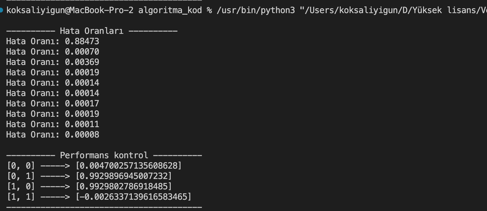

# Özet:
Bu projede, XOR işlevini öğrenmek için bir Yapay Sinir Ağı (YSA) modeli oluşturduk ve eğittik. Bu süreç, YSA'nın üç katmanlı bir yapıya sahip olması, ağırlıkların rastgele başlatılması ve geriye yayılım algoritması kullanılarak güncellenmesi dahil olmak üzere bir dizi adımı içerdi. Modelin eğitimi, veri kümesindeki örnekler üzerinde bir dizi iterasyon gerçekleştirdi, öğrenme hızı ve momentum parametreleri kullanılarak ağırlıkları güncelledi. Sonuç olarak, model, XOR işlevini başarıyla öğrendi ve veri kümesindeki örnekler üzerinde doğru tahminlerde bulundu. Bu projenin sonuçları, YSA'ların karmaşık işlevleri öğrenme yeteneğini ve ağırlıklarını doğru bir şekilde ayarlama önemini vurgulamaktadır.

## Veri Kümesi:
Bu projede, XOR işlevini öğrenmek için bir yapay sinir ağı (YSA) modeli oluşturduk. XOR işlevi, iki binary giriş alır ve bu girişlerin biri 1 ve diğeri 0 ise 1 döndürür, aksi takdirde 0 döndürür. Veri kümesi, bu XOR işlevinin tüm olası giriş ve çıkışlarını içerir:

##Veri Ön işleme:
Bu özel durumda, veri ön işlemeye gerek yoktu çünkü veriler zaten modelin gerektirdiği formattaydı (listeler halinde binary giriş ve çıkış değerleri). Her ne kadar bu basit örnekte veri önişleme adımına ihtiyaç duyulmasa da, gerçek hayatta kullanılan veri kümeleri genellikle bu tür bir işlem gerektirir. Veri önişleme, verilerin model tarafından daha kolay işlenmesini sağlar ve genellikle modelin performansını iyileştirir.

## Model Oluşturma:
Projede, belirli bir sayıda giriş, gizli ve çıkış nöronuna sahip bir Yapay Sinir Ağı (YSA) modeli oluşturduk. Bu modelin yapısı, giriş, gizli ve çıkış katmanlarından oluşan üç katmanlı bir mimariyi içerir. Bu ağırlıklar, modelin oluşturulması sırasında belirli bir aralıktaki rastgele değerlerle başlatılır. Geriye yayılım algoritması, hedef ve tahmini çıktılar arasındaki hata farkına dayalı olarak bu ağırlıkları günceller.

## Model Eğitimi:
Modelin eğitimi, veri kümesindeki örnekler üzerinde 5000 iterasyonun gerçekleştirilmesi ile yapılmaktadır. Öğrenme hızı ve momentum, modelin eğitimi sırasında ağırlıkların ne kadar hızlı güncelleneceğini belirleyen hiperparametrelerdir. Bu projede, öğrenme hızını 0.5 ve momentumu 0.2 olarak ayarladık. Bu değerler, her bir iterasyonda modelin girişleri çıkışlara nasıl tahmin ettiğini ve geriye yayılım algoritmasıyla ağırlıkları nasıl güncellediğini belirler. Eğitim sürecinde, her 500 iterasyonda bir, modelin toplam hatası hesaplanır ve çıktı olarak gösterilir. Bu, modelin öğrenme sürecini takip etmeyi ve gerektiğinde ayarlamalar yapmayı kolaylaştırır.

## Sonuçlar ve Değerlendirme:
Eğitim tamamlandıktan sonra, model, veri kümesindeki tüm örnekler üzerinde test edilir. Bu, modelin XOR işlevini ne kadar iyi öğrendiğini değerlendirmek için kullanılır. Sonuçlar genellikle yüksek doğruluk seviyesinde olacaktır, ancak her öğrenme döngüsü biraz farklı sonuçlar verebilir çünkü ağırlıklar başlangıçta rastgele atanmıştır. Bu projede, model, eğitim örneklerini doğru bir şekilde sınıflandırabildiği ve XOR işlevini başarıyla öğrendiği için, sonuçlar başarılı olarak değerlendirilmiştir.  Sonuç olarak, bu proje, bir YSA modelinin nasıl oluşturulacağını, eğitileceğini ve test edileceğini gösterir. Ayrıca, modelin hiperparametrelerinin (örneğin öğrenme hızı ve momentum) modelin sonuçları üzerinde önemli bir etkisi olabileceğini gösterir. Bu nedenle, bir YSA modelini eğitirken bu hiperparametrelerin dikkatlice seçilmesi önemlidir.

Bu model, XOR işlevini öğrenmek için yalnızca bir gizli katman kullandı. Ancak, daha karmaşık problemler genellikle daha fazla gizli katman veya daha fazla gizli nöron gerektirir. Bu, YSA modellerinin karmaşıklığının, çözülmeye çalışılan probleme bağlı olarak değişebileceğini gösterir. 

